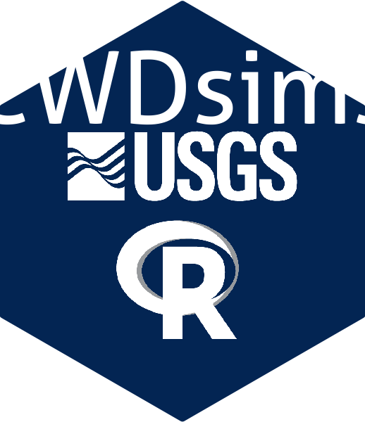

CWDsims 
=====================================================================================
R package to run chronic wasting disease (CWD) models and a Shiny app

This is a repository with R code for an interactive Shiny application of CWD disease models. Currently there are deterministic and stochastic models that are intended to model hunting scenarios for a 5 to 10 year time horizon. The models are sex and age structured with direct and indirect transmission. 

### Webpage for the shiny app ###

To run the shiny application online rather than installing it locally you can go to:  
https://paulchafeecr.shinyapps.io/comb_app_v2_CWD/

However, we recommend running the program locally in R for better performance. 

### Reporting bugs ###

Please consider reporting bugs and asking questions on the Issues page:

[https://github.com/pcross-usgs/CWDsims/issues](https://github.com/pcross-usgs/CWDsims/issues)


Follow `@USGS_R` on Twitter for updates on USGS R packages:

[](https://twitter.com/USGS_R)

### Installation ###

Install from GitHub using the `devtools` packages:

```r
# install devtools if you don't have it already (otherwise skip next line)
install.packages("devtools")

# load the library
library(devtools)

# install "CWDsims" from github
install_github("pcross-usgs/CWDsims", build_vignettes = TRUE)
```
Apple users may need to first install xQuartz to avoid a sys.font error.  

For a brief introduction to the package look at the CWDsims introduction vignette.  

```r
vignette(package = "CWDsims") # all vignettes available
vignette("CWDsimsIntroVignette") # load the introduction
```
For a list of the available functions: 

```r
?CWDsims
```
### Citing CWDsims ###

``` r
citation(package = "CWDsims")

># To cite CWDsims in publications, please
># use:
># 
>#   Cross, P.C. and E.S. Almberg. 2019. CWDsims: 
>#   An R package for simulating chronic wasting
>#   disease scenarios, doi:10.5066/P948SF4Q
># 
># A BibTeX entry for LaTeX users is
># 
>#   @Manual{,
>#     author = {Paul C. Cross and Emily S. Almberg},
>#     title = {CWDsims: An R package for simulating chronic wasing disease
>#     scenarios},
>#     publisher = {U.S. Geological Survey},
>#     address = {Reston, VA},
>#     version = {0.1.0},
>#     institution = {U.S. Geological Survey},
>#     year = {2019},
>#     url = {https://github.com/pcross-usgs/CWDsims/issues},
>#   }
```

### Disclaimer ###

This software is in the public domain because it contains materials that originally came from the U.S. Geological Survey, an agency of the United States Department of Interior. For more information, see the [official USGS copyright policy](https://www2.usgs.gov/visual-id/credit_usgs.html#copyright)

Although this software program has been used by the U.S. Geological Survey (USGS), no warranty, expressed or implied, is made by the USGS or the U.S. Government as to the accuracy and functioning of the program and related program material nor shall the fact of distribution constitute any such warranty, and no responsibility is assumed by the USGS in connection therewith.

This software is provided "AS IS."

[](http://creativecommons.org/publicdomain/zero/1.0/)
